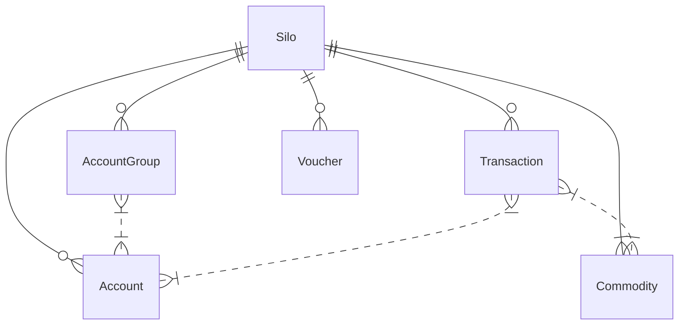

## Core Objects

Balancelynx revolves around `Commodities` being moved between `Accounts` via `Transactions`.
`Accounts` are grouped together in `AccountGroups`. Optionally, you can use `Vouchers`
to codify a mapping between your business logic and Balancelynx `Transactions`.

Before a `Transaction` is posted, it must satisfy the requirements posed by the
User-Defined Functions (UDFs) of all involved `Accounts` and `AccountGroups`.

Lastly, a `Silo` is a ledger, containing all other objects.

