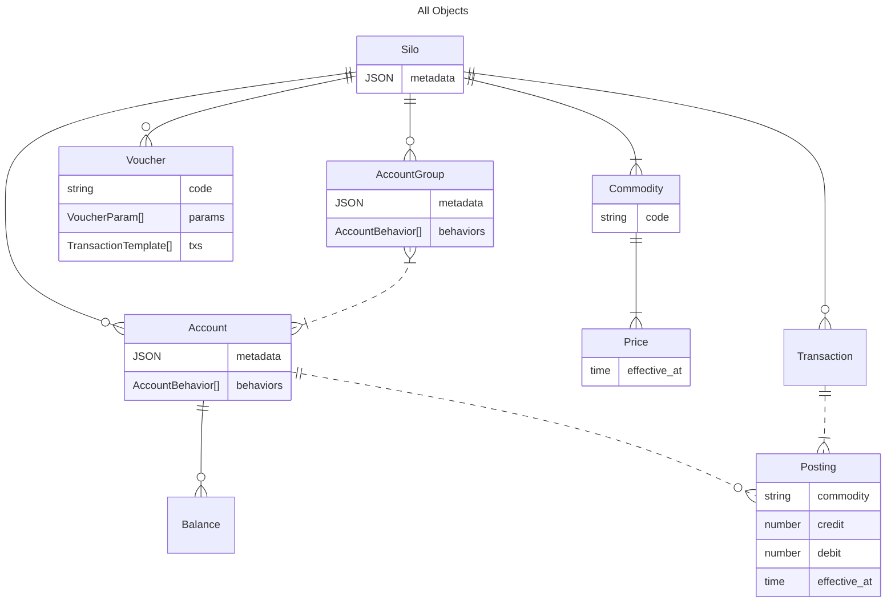

# Complete Object Diagram

```mermaid
---
title: All Objects
---
erDiagram
	Silo {
        JSON metadata
	}
	Account {
        JSON metadata
        AccountBehavior[] behaviors
    }
    AccountGroup {
        JSON metadata
        AccountBehavior[] behaviors
    }
    Voucher {
        string code
        VoucherParam[] params
        TransactionTemplate[] txs
    }
    Commodity {
        string code
    }
    Price {
        time effective_at
    }
    Transaction {

    }
    Posting {
        string commodity
        number credit
        number debit
        time effective_at
    }
    Silo one -- zero or more Account : ""
        Account one -- zero or more Balance : ""
        Account one .. zero or more Posting : ""
    Silo one -- zero or more AccountGroup : ""
        AccountGroup one or more .. one or more Account : ""
    Silo one -- one or more Commodity : ""
        Commodity ||--|{ Price : ""
    Silo one -- zero or more Transaction : ""
        Transaction one .. one or more Posting : ""
    Silo one -- zero or more Voucher : ""
```